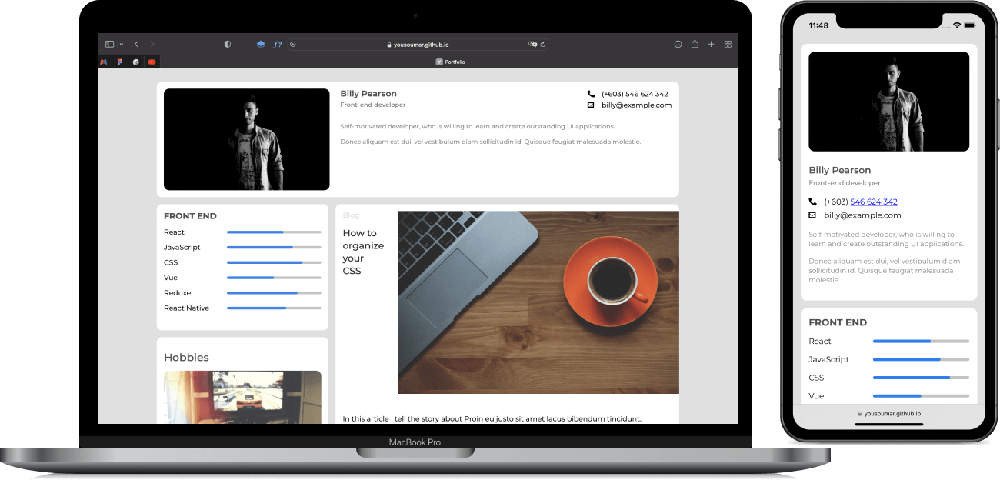

Intégration d'un **portfolio** `mobile first` et `responsive`, en `HTML`, `CSS`, et `JavaScript`.

C'est un <a href="https://devchallenges.io/challenges/5ZnOYsSXM24JWnCsNFlt">`challenge`</a> de `devchallenge.io`.

Visiter le site en cliquant sur l'image ci-dessous ou sur le lien en bas de la section `About`.

`Note : il s'agit là d'une ancienne réalisation mise récemment sur Github.`

<a href = "https://yousoumar.github.io/portfolio/"></img></a>